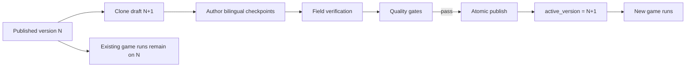

# TLV Quest Content Operating System

## Purpose

The Content Operating System turns quest content into a versioned operational product rather than mutable seed data. It protects live events, makes field readiness visible and creates a controlled path from authoring to production.

## Core invariant

Published content is immutable.

Every game run stores its template version and receives a full checkpoint snapshot when it is created. Publishing a newer template version changes only future runs; existing registrations, active games and completed events keep their original snapshot.

## Data model

### `template_versions`

Release-level metadata for each version:

- lifecycle: `draft`, `review`, `published`, `superseded`, `archived`
- release name and notes
- reusable theme configuration
- route-level configuration
- latest validation report
- creator, reviewer/publisher and timestamps

Only one `draft` or `review` version may exist per template at a time.

### `template_checkpoints`

The existing versioned checkpoint table remains the canonical authoring source. Each checkpoint stores:

- stable slug and sequence
- interaction kind
- physical location and verification radius
- bilingual story and task content
- answer/photo/location validation config
- hints and scoring
- accessibility and fallback data

### `checkpoint_health`

Operational readiness for the physical station:

- `not_required`
- `pending`
- `verified`
- `needs_attention`
- `blocked`

The row also stores checklist results, field notes and verifier metadata. Health is version-specific because a route edit can invalidate an earlier site check.

### `content_audit_log`

Append-only authoring events such as:

- draft creation
- version metadata changes
- checkpoint changes
- station health updates
- version publication

## Publishing gates

A version cannot be published unless:

1. It has at least one active checkpoint.
2. Every active checkpoint has Hebrew and English title and prompt.
3. Exactly one active checkpoint is a finale.
4. The finale is the last active checkpoint.
5. Location-sensitive checkpoints have coordinates and a positive radius.
6. Every checkpoint marked for field verification is verified.

The database RPC repeats the critical checks transactionally. Frontend validation is guidance, not the source of truth.

## Security model

- The studio uses the existing Supabase Magic Link admin session.
- Every API route calls `requireAdmin` and checks the admin allowlist.
- Authoring tables have RLS enabled and no grants for `anon` or normal `authenticated` users.
- Draft creation and publication RPCs are executable only by the service role.
- The browser never receives the Supabase secret key.
- Published versions are rejected by update APIs and must first be cloned into a draft.

## V1 user journey

1. Open `/admin` and authenticate.
2. Open `/admin/content`.
3. Select a route and inspect its versions.
4. Clone the published version into a new draft.
5. Edit release metadata, theme and route config.
6. Edit bilingual checkpoint content, location, validation, hints, scoring and accessibility.
7. Complete the physical station checklist and mark each required station verified.
8. Review the publish gate report.
9. Publish atomically; future runs use the new active version.

## Deliberate V1 constraints

- Checkpoints can be edited, enabled or disabled, but creation, deletion and drag reordering are deferred.
- Advanced interaction configuration remains JSON to preserve the existing flexible engine contract.
- There is one open draft per route to avoid conflicting branches in the first operational version.
- Asset upload, map-based route editing, collaborative review and localization workflows are future layers.

## Next layers

### V1.1 — Route composition

- create, duplicate and delete checkpoints
- drag-and-drop ordering
- structured editors for validation, hints and scoring
- map canvas and route-distance calculation
- QR/NFC asset generation and inventory

### V1.2 — Field operations

- mobile field-check mode with GPS proof and photos
- scheduled station re-verification
- station incident history and automatic health expiry
- pre-event route readiness report

### V1.3 — Content intelligence

- checkpoint abandonment, wrong-answer and hint-rate analytics
- content experiments by template version
- AI-assisted translation and consistency checks
- difficulty and walking-time recommendations
- automatic draft proposals based on game telemetry

### V2 — Multi-route platform

- reusable themes, checkpoint blocks and story modules
- role-based author/reviewer/publisher permissions
- organization workspaces
- route marketplace and white-label brands
- export/import package format
