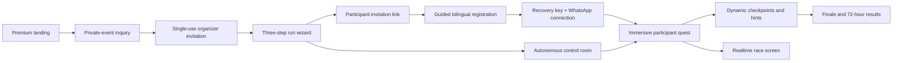

# TLV Quest — Premium Experience Plan

## Product position

TLV Quest should feel like a private cultural experience rather than a generic scavenger-hunt app. The visual and interaction language is built around a recovered 1936 archive: midnight navy, aged ivory, brass, cartographic lines, signals, coordinates and restrained motion.

The core promise remains operationally simple:

> One invitation creates a self-running, bilingual urban quest. Participants move through the real port while the system handles registration, teams, messaging, validation, scoring, progression and results.

## Experience principles

1. **The world is the interface** — the phone should direct attention back to the harbor rather than becoming the main attraction.
2. **Every screen advances the story** — loading, registration, waiting, errors and results all belong to the same fiction.
3. **Progressive disclosure** — participants see only the next useful action; organizers start from opinionated presets and open advanced controls only when needed.
4. **Exclusive by design** — private invitations, separate participant/control/live links and limited post-game access create intentional scarcity.
5. **Operational confidence** — visible system status, recovery paths, idempotent actions and emergency controls prevent a premium event from feeling fragile.
6. **Privacy without friction** — explain location, media and retention at the exact point they become relevant.

## End-to-end journey

## Implemented upgrade

### Marketing and acquisition

- Cinematic bilingual landing experience with an original harbor, lighthouse and time-capsule visual system.
- Clear invitation-only positioning and private-session inquiry form.
- Server-side validated lead capture into the existing private `marketing_leads` table.
- Honeypot, payload limits, field validation and duplicate throttling.
- Open Graph, Twitter and application metadata with original share artwork.

### Organizer journey

- Three-step creation wizard with event presets, team-mode cards and progressive advanced options.
- Separate post-creation cards for participant invitation, secret control room and public race screen.
- One-click copy and WhatsApp sharing.
- Premium autonomous control room with visibility-aware refresh, live metrics, route status, broadcast and emergency overrides.

### Participant journey

- Invitation-style bilingual onboarding instead of a generic form.
- Explicit recovery-key moment and guided WhatsApp connection.
- Immersive game interface with dynamic checkpoint totals, story-led feedback, point-in-time location explanation, camera-first photo missions and persistent bottom tools.
- Visibility-aware polling to reduce needless requests when the app is backgrounded.

### Spectator journey

- Cinematic public race screen with podium, progress bars, realtime status and dynamic route length.
- Precise locations and solutions remain hidden.

### Backend and reliability

- Added dynamic experience metadata without exposing service credentials or widening RLS access.
- Kept existing leaderboard endpoint backward compatible and added a dedicated experience endpoint.
- Expected WhatsApp states such as required location verification now produce guided replies and informational logs rather than production error clusters.
- Existing encrypted PII, opaque token, idempotency and retention architecture remains intact.

## Visual asset policy

The supplied KlingAI images were used as a private moodboard only. They contain visible third-party watermarks, so they are not shipped in the product. The implementation uses new original SVG artwork committed to the repository, which is lightweight, responsive, cacheable and free from external runtime dependencies.

## Quality gates

Before production merge:

- TypeScript production build passes.
- ESLint and unit tests pass.
- Playwright covers Hebrew/English landing, bilingual registration and invitation-only organizer creation.
- Vercel preview is inspected on mobile and desktop.
- Supabase security and performance advisors are reviewed.
- Production runtime logs are checked after deployment.

## Next product layer

The next meaningful expansion is not another visual redesign. It is a content operating system:

- Versioned quest authoring UI.
- Reusable visual/story themes per route.
- Field-verification checklist and station health state.
- Event CRM pipeline for `marketing_leads`.
- Automated organizer email/WhatsApp pack.
- Post-game gallery and personalized recap.
- Experiment metrics: inquiry conversion, registration completion, WhatsApp connection, checkpoint abandonment, hint rate and finish rate.
